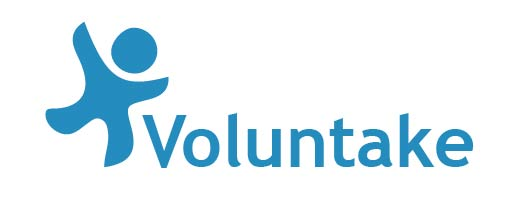

# Volunteer Application

### <i> Android Studio Application Project of Software Engineering Course (third year of computer science) </i>

## Collaborators:

1. [Liel Berniker](https://github.com/LielBerniker)
1. [Kfir Goldfarb](https://github.com/kggold4)
1. [Dvir Segal](https://github.com/Dvir-Segal)

## Purpose:

match between volunteers and associations